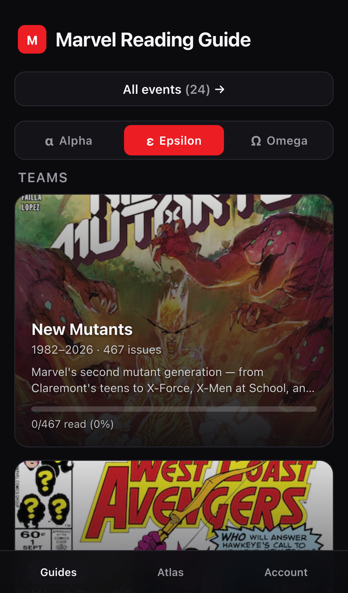
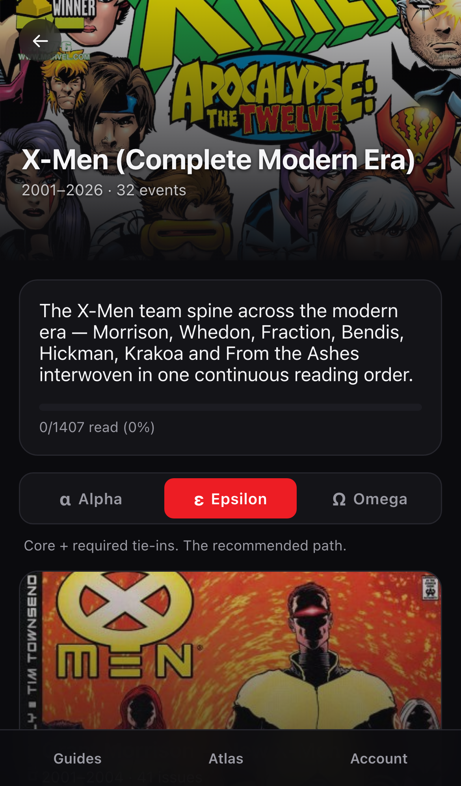
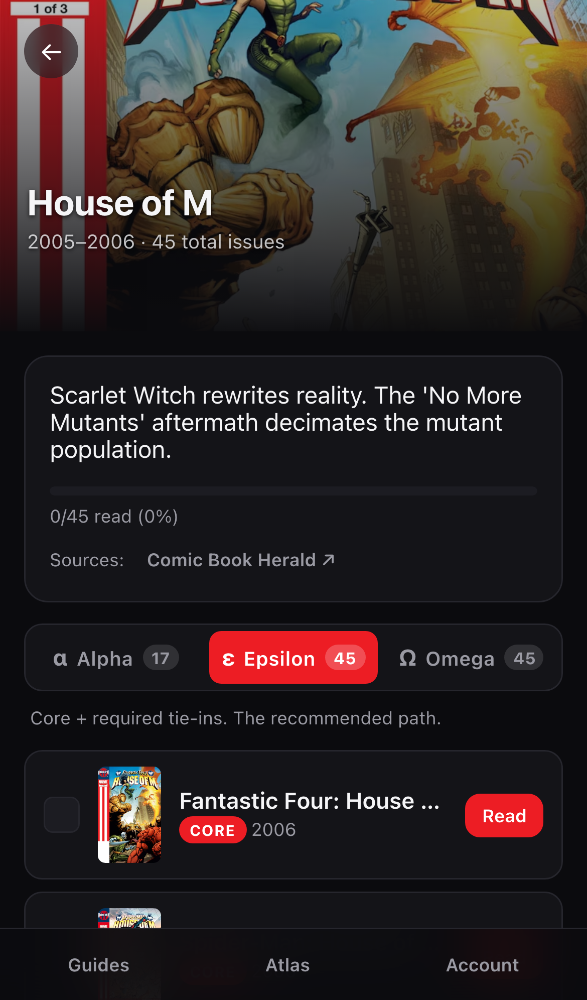
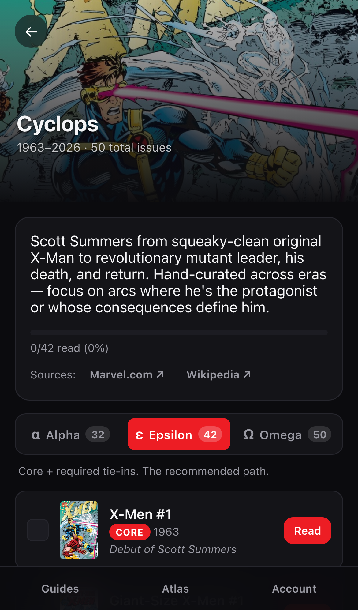
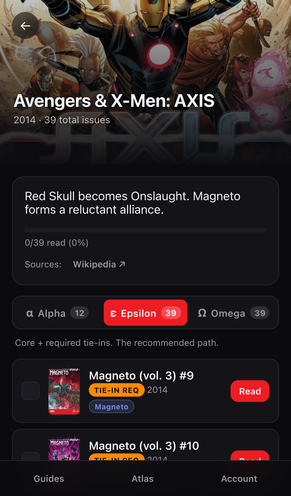
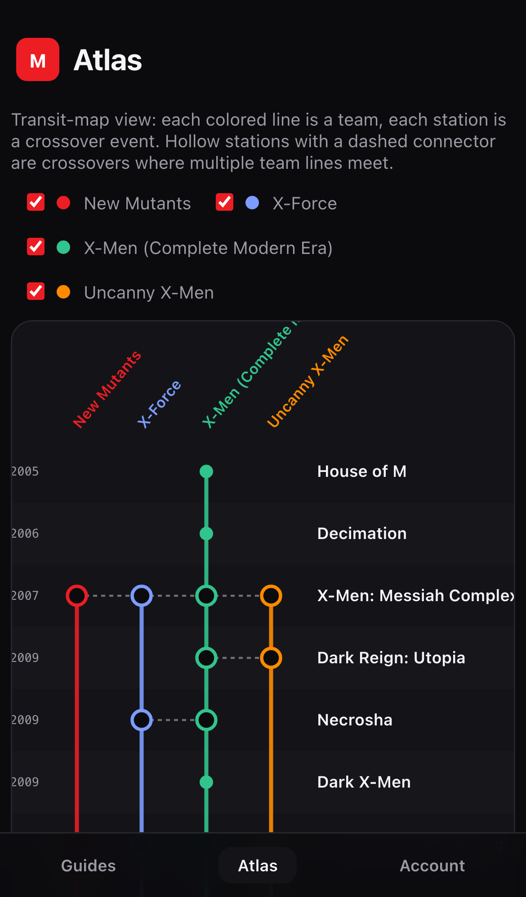
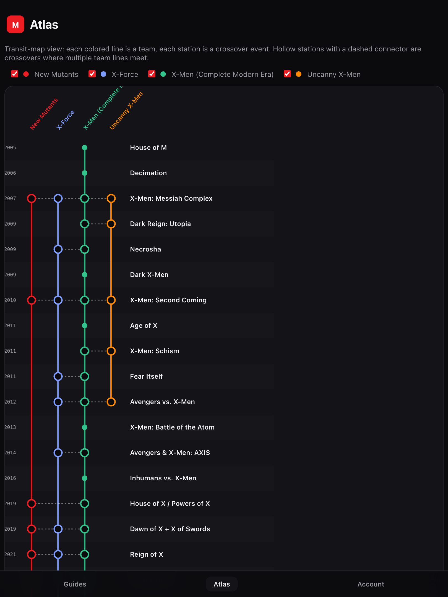

# Marvel Reading Guide

[](https://github.com/diega/marvel-reading-guide/actions/workflows/deploy.yml)
[](https://github.com/diega/marvel-reading-guide/actions/workflows/update-data.yml)

A mobile-first Progressive Web App that turns 30+ years of Marvel crossover
events, creative-team runs and character/team histories into **curated reading
orders** — with Alpha / Epsilon / Omega depth levels, a transit-map atlas of
how team lines cross, and one-tap deeplinks to each issue on marvel.com.

<p align="center">
  
  
  
</p>

<p align="center">
  
  
  
</p>

<p align="center">
  
  <br>
  <em>Atlas on iPad — each colored line is a team, each station a crossover event. Hollow stations are interchanges where multiple teams meet.</em>
</p>

---

## What this is

- **Reading guides** for 30+ Marvel crossover events (House of M, Messiah
  Complex, AvX, X of Swords, Hickman's Krakoa era, Fall of X, Age of
  Revelation, A.X.E., Fear Itself…) plus curated team spines (Uncanny X-Men,
  X-Force, New Mutants, West Coast Avengers) and character timelines (Cyclops,
  Wolverine, Magneto, Cable).
- **Three depth levels** per reading guide: α Alpha (core only), ε Epsilon
  (core + required tie-ins), Ω Omega (everything including preludes, optional
  tie-ins, epilogues).
- **Transit-map atlas** showing how team reading orders intersect at crossover
  events — stations = events, lines = teams, hollow stations with dashed
  connectors = crossovers where multiple team lines meet.
- **Progress tracking** persisted locally in IndexedDB (Dexie). Tap the
  checkbox on an issue to mark it read — nothing leaves your device.
- **Marvel.com deeplinks**: each issue opens its marvel.com page in a new tab.
- **Fully offline-capable PWA** (vite-plugin-pwa + Workbox). Cover images are
  cached from Marvel's CDN on first view.
- **Bilingual UI** (Español / English).

## Extension points

The PWA exposes four runtime extension points on boot — any overlay that
serves an ES module at `/extensions/index.js` can swap:

| Point | Default | Override use case |
|-------|---------|-------------------|
| `auth` | anonymous (no login) | gate the app behind a custom auth flow |
| `progress` | local Dexie | sync read state with a remote backend |
| `deeplink` | marvel.com web URL | open issues via a native app URL scheme |
| `AccountExtras` | null | add UI to the Account screen (sign-out, profile…) |

The bundle loads the overlay via dynamic `import()` on startup; a 404
silently falls back to defaults. Contracts live in
[`pwa/src/lib/extensions.ts`](pwa/src/lib/extensions.ts).

## Repository layout

| Path | Purpose |
|------|---------|
| [`pwa/`](pwa/) | React + Vite PWA. Deployed to Cloudflare Pages. |
| [`scripts/`](scripts/) | Data pipeline: CBH / Wikipedia scrapers, Marvel sitemap + ComicVine enrichers, override management. |
| [`pwa/src/data/events.json`](pwa/src/data/events.json) | The canonical reading-list dataset, committed. |

## Data pipeline

`events.json` is produced by running the scrapers and enrichers in order:

```bash
cd scripts
npm install
npm run scrape:cbh           # Comic Book Herald — events + characters + teams
npm run scrape:wikipedia     # Wikipedia — events CBH doesn't cover cleanly
npm run merge:manual         # Hand-curated guides (manual-guides.json)
npm run gen:runs             # Creative-team runs (Morrison, Whedon, Hickman, …)
npm run enrich:sitemap       # marvel.com sitemap → slug, marvelId, digitalId, cover
CV_API_KEY=xxx npm run enrich:comicvine   # ComicVine fallback for covers
```

See [`scripts/README.md`](scripts/README.md) for details. All sources are
public; the pipeline never authenticates against Marvel/Disney.

### Credits / upstream sources

The dataset combines work from several upstream projects — the curation,
arrangement, depth-level annotations, and editorial notes are original to
this repo, but the underlying facts (which issues belong to which event,
covers, publication info) come from:

| Source | What we use | Notes |
|--------|-------------|-------|
| [Comic Book Herald](https://www.comicbookherald.com/) | Event reading orders, character/team histories | The original editorial selection of issues per event is CBH's work. Their reading guides are the backbone of the dataset. |
| [Wikipedia](https://en.wikipedia.org/) | Title lists + summaries for crossovers CBH doesn't cover | CC BY-SA 4.0 content — only non-copyrightable facts (titles, issue numbers, years) are extracted. |
| [Marvel.com](https://www.marvel.com/) sitemap + [bifrost](https://bifrost.marvel.com) GraphQL | Issue identifiers (marvelId, digitalId, DRN, slug) + cover URLs | Public unauthenticated endpoints. Cover URLs point back to Marvel's CDN; no images are redistributed. |
| [ComicVine](https://comicvine.gamespot.com/api/) | Cover URL fallback | Fetched with a user-provided API key. ComicVine's ToS requires attribution, which the NOTICE file provides. |

See [`NOTICE`](NOTICE) for the full attribution text.

## Development

```bash
cd pwa
npm install
npm run dev           # dev server at http://localhost:5173

# Build + deploy to Cloudflare Pages
npm run build
CLOUDFLARE_API_TOKEN=... CLOUDFLARE_ACCOUNT_ID=... ./deploy.sh
```

See [`pwa/README.md`](pwa/README.md) and [`CONTRIBUTING.md`](CONTRIBUTING.md).

## Deploying your own copy

Configure the repository secrets and variables below, then push to `main` —
`.github/workflows/deploy.yml` takes care of the rest. The workflow
auto-creates the Pages project if it doesn't exist.

### Required repository secrets

Settings → Secrets and variables → Actions → **Secrets** tab.

| Secret | Purpose |
|--------|---------|
| `CLOUDFLARE_API_TOKEN` | [Cloudflare API token](https://dash.cloudflare.com/profile/api-tokens). See scopes below. |
| `CLOUDFLARE_ACCOUNT_ID` | Your Cloudflare account ID (dash sidebar → Workers & Pages → account ID). |
| `CV_API_KEY` _(optional)_ | [ComicVine API key](https://comicvine.gamespot.com/api/) — only used by the manual `Update data` workflow to top up cover images. |

### Required repository variables

Settings → Secrets and variables → Actions → **Variables** tab (not Secrets —
these are non-sensitive config and surface in logs).

| Variable | Required? | Purpose |
|----------|:---------:|---------|
| `CF_PAGES_PROJECT` | yes | Cloudflare Pages project name to deploy into (e.g. `marvel-reading-guide`). The workflow fails fast if unset — there is no silent default, so what gets deployed where is always explicit. |
| `PWA_CUSTOM_DOMAIN` | no | Custom domain to attach to the Pages project (e.g. `example.com` or `reader.example.com`). When set, the workflow (a) attaches the hostname to the project and (b) upserts a proxied CNAME → `{CF_PAGES_PROJECT}.pages.dev` in the hosting zone. Unset = stick with the `*.pages.dev` URL and skip the custom-domain step entirely. |

### Token scopes

- **Minimum** (deploy to `*.pages.dev` only): `Account · Cloudflare Pages : Edit`.
- **With `PWA_CUSTOM_DOMAIN`**: add `Zone · Zone : Read` + `Zone · DNS : Edit`,
  ideally scoped to just the zone hosting your custom domain.

## License

Dual-licensed:

- **Source code, build scripts, documentation** — [Apache License 2.0](LICENSE).
  Attribution requirements are carried by the [`NOTICE`](NOTICE) file;
  redistributions and derivative works must keep it.
- **Curated reading-list dataset** (`pwa/src/data/events.json`) —
  [Creative Commons Attribution 4.0 International](https://creativecommons.org/licenses/by/4.0/).
  Any surface presenting the data must attribute the source.

Attribution line to use in either case:

> Marvel Reading Guide — © 2026 Diego López León
> https://github.com/diega/marvel-reading-guide

Marvel, X-Men and all related names, characters and indicia are property of
Marvel Entertainment, LLC. This project is a non-commercial, personal-use
fan companion and doesn't redistribute any Marvel content beyond publicly
available metadata.
